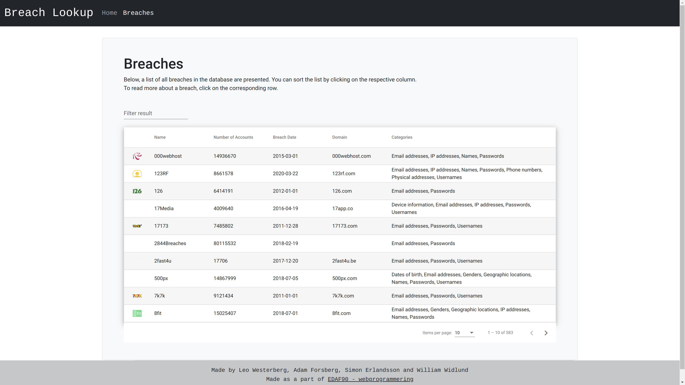

# EDAF90-projekt
Angular application which presents data regarding past breaches of websites. Made as a part of EDAF90 @ LTH.

Contributors: Leo Westerberg, Adam Forsberg, William Widlund & Simon Erlandsson.

To run, install Angular, navigate to ./breach-lookup and run "ng serve".
